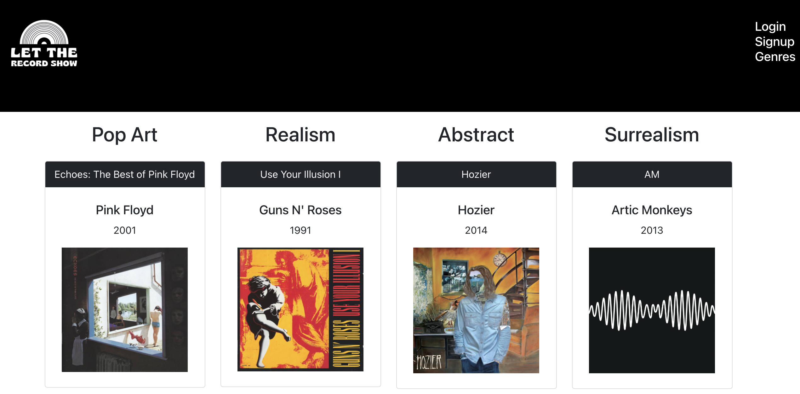

# Let the Record Show

## Description

We've built an app that lets a user login and vote on which art style best describes their favorite album covers. This app was built using `React`, `GraphQl`, and `MongoDB`.

## Table of Contents

- [License](#License)
- [Deployed Application and Usage](#Deployed-Application-and-Usage)
- [Future Development](#Future-Development)
- [Questions](#Questions)
- [Acknowledgements](#Acknowledgements)
- [Screenshots](#Screenshots)

## License

MIT

## Deployed Application and Usage

Follow this link to use the app. Vote on cover art from your favorite albums, view albums by art style.
[Let the Record Show](https://diva-hams.herokuapp.com/)

## Future Development

### Version 2.0

Future development of this app will include the usage of a third-party API for an extensive collection of album art. We will also provide a more comprehensive set of art genres to select from. Let the Record Show will record the user’s choice for each album, not only do we want to see the genres collection changing dynamically and displaying on the /genres route every time a user makes a selection, but before the next album cover to vote on loads, we’ll include a visual representation of all the data collected on that coverb art to date.

### Version 3.0

After accomplishing the sbove, we will add a social media sharing capability to drive more traffic to the site and create a more exciting user experience as the data updates at a quicker pace. We will also establish an interactive community for our users by adding reaction and comment functionality. We’d love to encourage inspiring discussions about art and music, and foster an intellectually and artisticlly stimulating environment.

## Questions

For additional information please contact us via GitHub at [github.com/divahams](https://github.com/divahams) or via [email](mailto:valerie227@gmail.com?subject=[GitHub]%Let%the%Record%Show).

## Acknowledgements

_Diva Hams_
[Valerie Michalecki](https://github.com/vmichalecki), [David Rivera](https://github.com/riveraadavid), [Heidi Reyes](https://github.com/heidi457) and [Miguel Alicea](https://github.com/malicea0783)
[github.com/divahams](https://github.com/divahams)

## Screenshots

